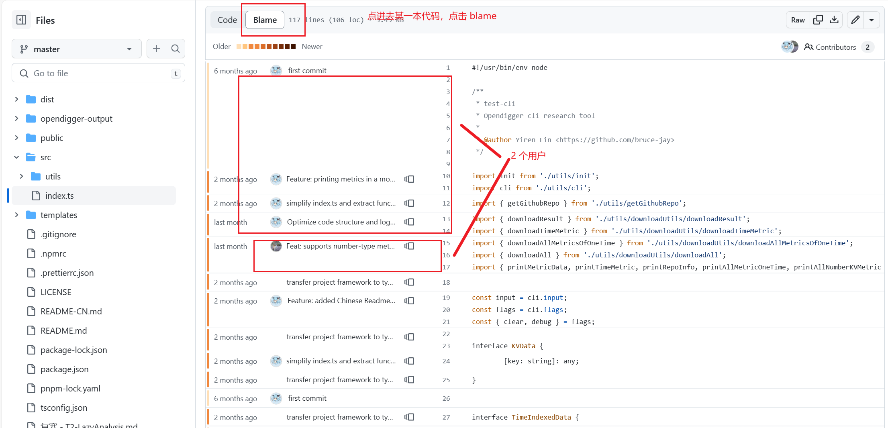
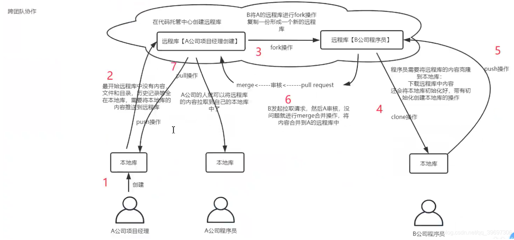
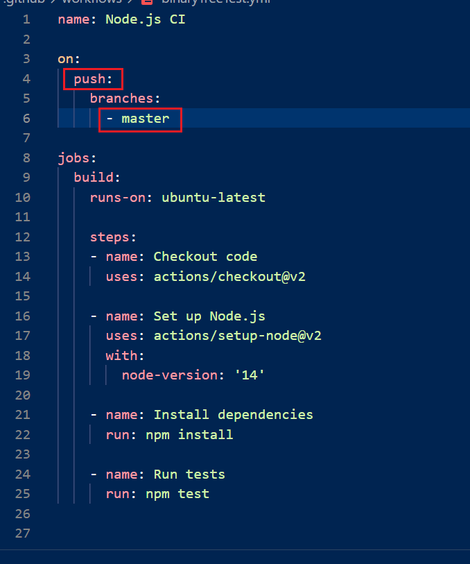
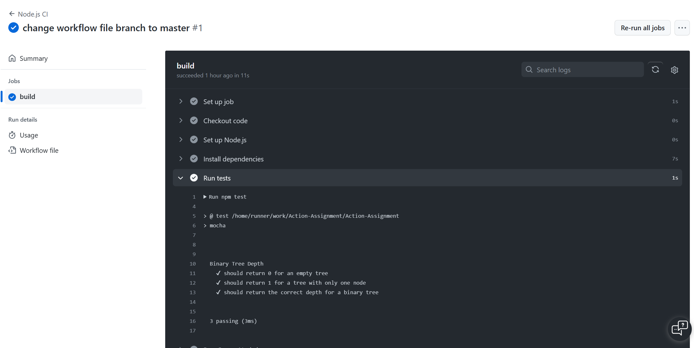

# 云计算 11.24 Assignment

ddl：12.8（两周后，应该也是同学们期中考试的时间，初步定下来了）

本次作业不需要提交实验报告，只要 Pull Request 通过，本仓库的 Readme 出现你们的学号就算通过。

## 项目任务

项目整体目标：新建一个仓库，编写一个简单的算法代码（任何语言，但不要撞题）并且编写 actions yml 和测试文件进行自动测试（需要看到 Actions 部分成功的界面）。

2-4 个人一组，每个人的职责：

组长：首先，组长需要新建一个仓库（用于存储你们队伍的代码，**不要使用 fork Bruce-Jay/Action-Assignment 作为你们的代码仓库**！）然后，组长需要在 Bruce-Jay/Action-Assignment 这个仓库下提 issue，如何提 issue 请看 issue #1。随后组长 fork 我的仓库，并且在 Readme 中添加一行：包含仓库名称、组长学号、组员的学号。样式如下：

| 仓库名称                                      | 组长学号    | 组员学号 | 组员学号 | 组员学号 |
| --------------------------------------------- | ----------- | -------- | -------- | -------- |
| https://github.com/zhang-san/Your-action-repo | 102155014xx |          |          |          |

之后组长需要和组员协调选择算法、编程语言、分工。可以一位组员负责实现算法，另一位组员负责实现测试代码（这一部分可能会比较难，因为大家初次接触，可以选择同步/异步协作完成），另一位组员负责实现 action 的 yml 文件。或者其他的分工方式都是可以的，不严格要求每个人的工作内容。

但是！！！需要体现协作过程！我会如何 review 你们的协作流程？看每一本文件代码的 Blame

## GitHub 协作流程介绍

github 的协作流程可以参考以下这张图片：

实现步骤可以概括如下：

1. 队长创建仓库，队员 fork 仓库。队员如果需要对仓库代码进行编辑，就需要 git clone 到本地。（队员在本地开发的过程中，也可以选择新建一个分支，在这个分支上完成工作以后，在自己 fork 的仓库中提 pull request ，review 代码确定没有问题后把新分支的内容合并到原分支中。）（上图的 3、4、5 步骤）
2. 队员将代码变更同步到自己 fork 的仓库的主分支上以后，向队长仓库提 pull request。Pull request 的标题可以是 Feat: 增加对于代码的测试功能 等等。队长 review 代码以后，发现没有问题，就直接合并代码。（上图的 6 步骤）
3. 队长在编辑自己的仓库时也需要 git clone ，也可以选择新建一个分支然后合并。（当然这是一个代码量巨小的项目所以也不需要那么严格）（上图的 4，5 步骤，不过不需要给别人的仓库提 PR）
4. 最后，队长更新 Bruce-Jay/Action-Assignment 仓库的 fork, 即更新 Readme 文件，向助教 Bruce-Jay 的仓库提 pull request，由助教来审核。（上图的 6 步骤）

队长也要负责这一部分的 review，**检查完成以后提的正确的 PR 才会被我合并到课程仓库中并且 close**。也就是说，队长对给助教提的 pull request 负有直接责任，需要特别重视。

如果课程仓库的 README 中出现你们的学号姓名：恭喜你们完成本次作业！

## 作业完成参考

可以直接参考这个项目，这个项目的 src/binaryTreeDepth.js 文件中实现了一个计算二叉树深度的方法。同时我们创建了 test/test.js 文件，用于存储测试代码。

测试代码我们使用 mocha 语法进行编写，mocha 是一个经典的 javascript 代码测试库，官方文档地址：https://mochajs.org/

也可以通过上网查找，使用人工智能模型进行辅助思考等工具，探索别的开发语言与测试工具。

我们还需要在项目根目录下创建 .github/workflows 文件夹中的 yml 文件，编写自动化脚本。脚本内容可以模仿上次的作业，也可以仿照本仓库的 yml 文件进行编写。yml 文件中，需要包含运行测试文件的命令。在 nodejs 环境中可以直接使用 `npm test` 来运行（需要用户自行配置 scripts 下的 test 对应的内容）。

在编写 yml 文件时，需要特别注意，在什么操作（push）时候触发，在哪个分支（master）上触发。

最后也可以在项目中加上 .gitignore 文件，防止提交一些不必要的库文件（比如 npm 项目下的 node_modules/）

GitHub Actions 测试结果：

## 附录

1. GitHub 官方文档，如何触发工作流：https://docs.github.com/zh/actions/using-workflows/triggering-a-workflow#using-events-to-trigger-workflows
2. `runs-on: ubuntu-latest` 是什么意思：https://www.volcengine.com/theme/5982053-G-7-1
3. 阮一峰——GitHub Actions 入门教程：https://www.ruanyifeng.com/blog/2019/09/getting-started-with-github-actions.html
